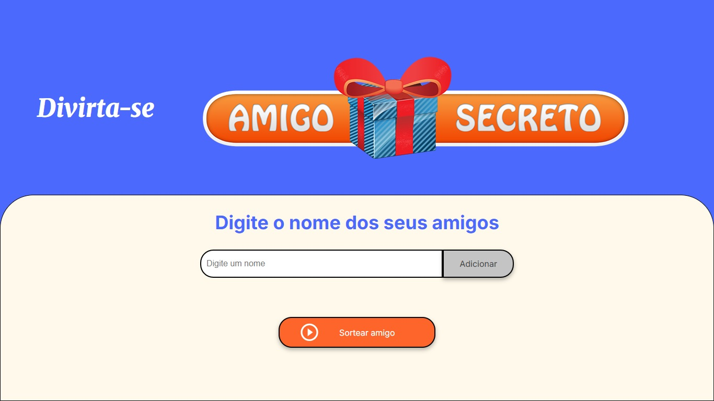

# 🎁 Amigo Secreto


## 🌟 Sobre o Projeto

Este é um **jogo interativo de Amigo Secreto**, onde os usuários podem adicionar participantes e sortear aleatoriamente um nome. Criado para facilitar o processo de sorteio de forma simples e rápida! 🎉

Com uma interface amigável e design responsivo, qualquer pessoa pode utilizá-lo sem dificuldades.

---

## 🎯 Funcionalidades

✅ **Adicionar amigos à lista**  
✅ **Evitar nomes duplicados** 🔥 *(Nova funcionalidade!)*  
✅ **Remover amigos da lista** ❌ *(Nova funcionalidade!)*  
✅ **Sortear um amigo aleatório**  
✅ **Exibir o resultado do sorteio na tela**  
✅ **Design responsivo para diferentes dispositivos**  

---

## 🆕 Novas Melhorias

### ✅ **1. Validação para evitar nomes repetidos**
Agora, o sistema impede a inserção de nomes duplicados. Se um nome já existir na lista, um **alerta é exibido**, evitando repetições no sorteio.

🔎 **Código Implementado:**
```javascript
if (listaDeAmigos.includes(nome)) {
    alert("Este nome já foi adicionado!");
    return;
}
```

---

### ✅ **2. Botão para remover nomes da lista**
Cada nome adicionado agora aparece com um botão ❌, permitindo que o usuário **remova qualquer nome** antes do sorteio.

🔎 **Código Implementado:**
```javascript
function removerAmigo(index) {
    listaDeAmigos.splice(index, 1);
    atualizarLista();
}
```

---

## 🎨 Capturas de Tela

### 📌 Interface Principal  
  
*Aqui você pode adicionar amigos e iniciar o sorteio!*

---

## 🎥 Demonstração em Vídeo  

🔎 **Assista ao funcionamento do jogo:**  
[🎬 Ver Vídeo](https://github.com/BraulioAmorim/challenge-amigo-secreto_pt/raw/main/assets/Demostração%20em%20Video.mp4)  

O vídeo mostra a adição de nomes, remoção de participantes e o sorteio em ação! 🎲✨  

---

## 🚀 Tecnologias Utilizadas

🛠 **HTML5** → Estrutura da página  
🎨 **CSS3** → Estilização e responsividade  
⚡ **JavaScript (ES6+)** → Lógica do sorteio  

---

## 📥 Como Executar?

1️⃣ **Clone este repositório:**  
```sh
git clone https://github.com/BraulioAmorim/challenge-amigo-secreto_pt.git
```
2️⃣ **Acesse a pasta do projeto:**  
```sh
cd challenge-amigo-secreto_pt
```
3️⃣ **Abra o arquivo `index.html` no navegador.**  

💡 **Dica:** Se estiver usando VS Code, pode instalar a extensão **Live Server** para rodar o projeto com recarregamento automático! 🔥  

---

## 👨‍💻 Desenvolvedor

Criado por **Braulio Amorim** 💻  

📌 **GitHub:** [](https://github.com/BraulioAmorim)  

📌 **Gostou do projeto?** Deixe uma ⭐ e compartilhe! 😃  

---

## 📝 Licença

Este projeto está licenciado sob a **MIT License** - veja o arquivo [LICENSE](https://github.com/BraulioAmorim/challenge-amigo-secreto_pt/blob/main/LICENSE) para mais detalhes.  

---

🚀 **Agora com mais funcionalidades e um design incrível!** Divirta-se com o sorteio! 🎁🔥
